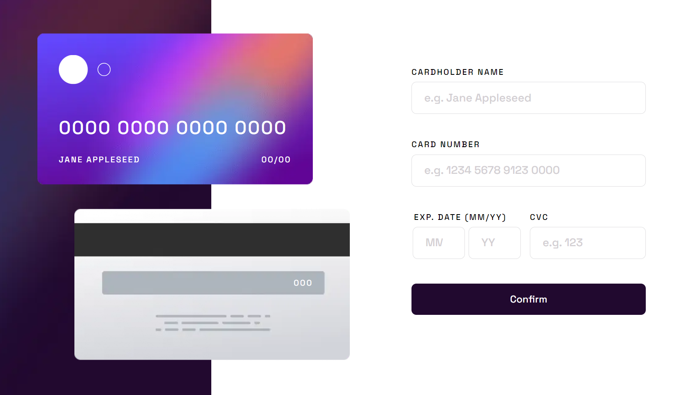
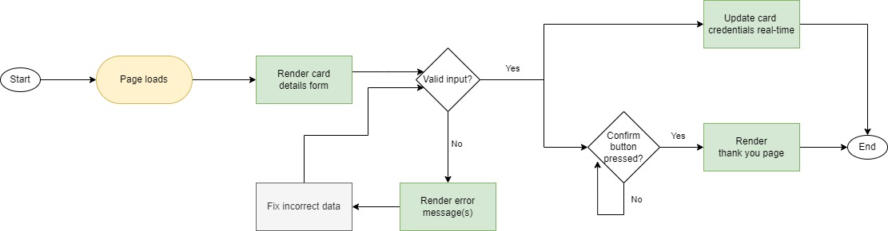
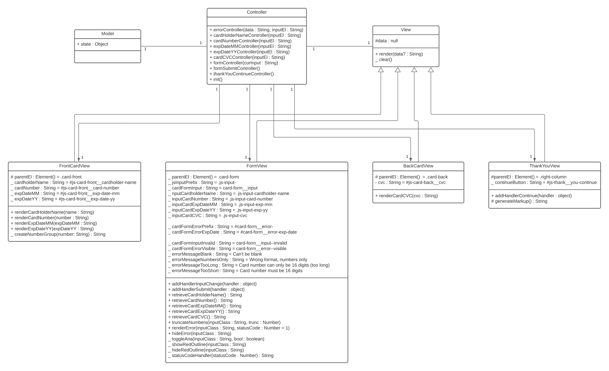

# Frontend Mentor - Interactive card details form

This is a solution to the [interactive card details form challenge on Frontend Mentor](https://www.frontendmentor.io/challenges/interactive-card-details-form-XpS8cKZDWw). Frontend Mentor challenges help you improve your coding skills by building realistic projects.

Difficulty: `junior`

[//]: # 'Insert screenshot below'

**Deployment status** 

## Table of contents

- [Frontend Mentor - Interactive card details form](#frontend-mentor---interactive-card-details-form)
  - [Table of contents](#table-of-contents)
  - [Overview](#overview)
    - [The challenge](#the-challenge)
    - [Links](#links)
  - [My process](#my-process)
    - [Built with](#built-with)
    - [What I learned](#what-i-learned)
    - [Continued development](#continued-development)
    - [Useful resources](#useful-resources)
  - [Project information](#project-information)
    - [User stories and features](#user-stories-and-features)
    - [Flowchart](#flowchart)
    - [Class diagram](#class-diagram)
  - [Author](#author)

## Overview

### The challenge

To build the interactive card details form according to the given designs as close as possible.
The users should be able to:

- Fill in the form and see the card details update in real-time
- Receive error messages when the form is submitted if:
  - Any input field is empty
  - The card number, expiry date, or CVC fields are in the wrong format
  - _custom:_ card number is too short or too long
- View the optimal layout depending on their device's screen size
- See hover, active, and focus states for interactive elements on the page
- See the completed state if there are no errors on form submission
- Reset the form when the user clicks "Continue" on the completed state

### Links

- Solution URL: [open GitHub repository](https://github.com/YariMorcus/interactive-card-details-form)
- Live Site URL: [open Netlify](https://interactive-cdf-ym.netlify.app)

## My process

### Built with

- Semantic HTML5 markup
- CSS _(BEM naming convention used, [see getbem.com](http://getbem.com) for more information)_
- Flexbox
- ES6 modules
- ES6 classes
- MVC (model-view-controller) architecture
- Mobile-first workflow
- Optimized for both Open Graph (Facebook) and Twitter Cards
- [Node.js](https://nextjs.org/) - Open source and multiplatform JavaScript runtime environment
- [NPM](https://www.npmjs.com/) - Package Manager for Node JavaScript platform
- [Browsersync](https://browsersync.io) - Synchronous browser testing (in collaboration with Gulp)
- [Parcel](https://parceljs.org/) - Zero configuration build tool / module bundler to automate workflow
- [Sass](https://sass-lang.com/) - CSS Preprocessor (in collaboration with Parcel)
- [GitHub](https://github.com/) - Technological platform based on Git
- [Git](https://git-scm.com/) - Free and open source distributed version control system
- [Netlify](https://www.netlify.com/) - Free service to host static webpages and web applications

### What I learned

1. Always use semantic compliant-standard HTML
2. To keep testing the application for Web Accessibility
3. To spend time looking at the details of the designs to create the application as accurately as possible
4. How to work with ES6 classes and modules
5. How to work with a zero configuration build tool such as Parcel
6. How to implement the MVC (model-view-controller) architecture in JavaScript
7. How to implement the Publisher-Subscriber pattern
8. How to write documentation for functions
9. How to implement a project configuration file and use it throughout the project
10. How to implement form validation using JS
11. How to solve problems with a framework _(provided by a [course](https://www.udemy.com/course/the-complete-javascript-course/) I followed)_
12. How to create a flowchart based on the given project information
13. How to create a class diagram based on the given project information

### Continued development

The way I want to continue to develop myself is by focusing on laying out a proper foundation of HTML, CSS, and JavaScript.
This so I can build quality websites for clients by just using the core languages of the Web.
At the present, I am working on the above things by going through (interactive) articles on the MDN Web Docs (see chapter [Useful resources](#useful-resources)).

Another way I want to improve my knowledge of these subjects is to do more challenges that [Frontend Mentor](https://www.frontendmentor.io/challenges) is offering, starting at the lowest level, and building that up to the more advanced ones.

Besides the above, I want to continue to develop myself by using several tools more often to improve my workflow. and spend less time doing things that can be automated.

A few tools that I will start using more often are:

1. Gulp
2. Parcel
3. Git
4. GitHub
5. Netlify (in combination with Continues Deployment)

_I will learn the above points in between but do not want to focus too much on those at the moment._

As soon as I am capable of creating quality websites with the core languages of the Web, I will start to learn JavaScript libraries and frameworks. Both of these change over time, so I do not want to spend my time on those before I have a solid understanding of prior mentioned languages.

### Useful resources

- [Transfonter](https://transfonter.org) - Has been used to convert the downloaded font files to woff and woff2 (most recent font formats, supported in all major browsers), and generate the corresponding `@font-face` css rulesets
- [Frontend Mentor - Interactive card details form challenge on Frontend Mentor](https://www.frontendmentor.io/challenges/interactive-card-details-form-XpS8cKZDWw)

## Project information

### User stories and features

1. As a user, I want to fill in the form so I can fill in the card details

   **Features**

   |     |                                                                                                    |
   | --- | -------------------------------------------------------------------------------------------------- |
   | 1   | A form in which the user can fill in a cardholder name, card number, exp. date (MM/YY) and CVC     |
   | 2   | Update card details in real-time                                                                   |
   | 3   | A `confirm` button so the user can submit their card details                                       |
   | 4   | Redirect user to thank you page when all requirements are met                                      |
   | 5   | System that provides the user with helpful error messages (both inline and form submit validation) |
   | 6   | System that provides a completed state when form field is valid                                    |

2. As a user, I want to see a 'Thank you' page so that I know that my card details are registered

   **Features**

   |     |                                                                   |
   | --- | ----------------------------------------------------------------- |
   | 1   | A `continue` button that redirects the user back to an empty form |

### Flowchart

### Class diagram

## Author

- LinkedIn - [Yari Morcus](https://www.linkedin.com/in/yarimorcus) _(must be logged in)_
- Frontend Mentor - [@YariMorcus](https://www.frontendmentor.io/profile/YariMorcus)
